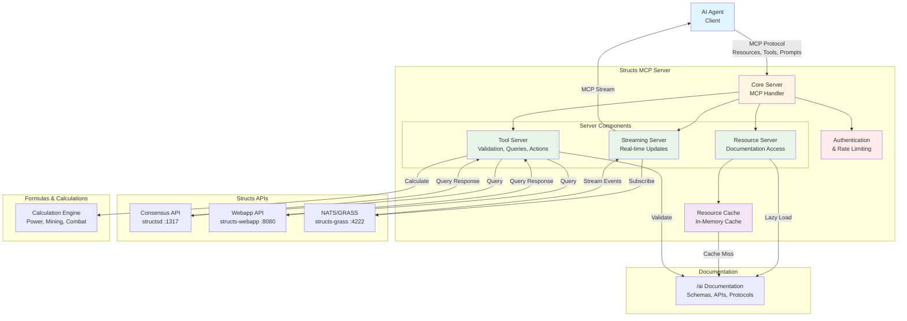

# Structs MCP Server Architecture

**Date**: December 8, 2025  
**Status**: 🟢 Design Phase  
**Version**: 0.1.0

---

## Overview

The Structs MCP Server provides AI agents with structured access to Structs documentation, schemas, APIs, and real-time game state through the Model Context Protocol (MCP).

---

## System Architecture



---

## Components

### 1. Resource Server

**Purpose**: Serve all `/ai` documentation as MCP resources

**Responsibilities**:
- Map documentation files to resource URIs
- Serve resources on demand
- Handle versioning
- Cache resources for performance
- Lazy load resources (load on first access)
- Handle resource updates and invalidation

**Resource Loading Strategy**:
- **Lazy Loading**: Resources are loaded from disk on first access
- **Caching**: Loaded resources are cached in memory for subsequent requests
- **Cache Invalidation**: Cache is invalidated when source files change (file watcher or manual refresh)
- **Update Handling**: Support for hot-reloading documentation updates without server restart

**Resource Types**:
- Schemas (JSON)
- API Specifications (YAML)
- Protocols (Markdown)
- Examples (JSON)
- Reference Indexes (JSON)

**Performance Considerations**:
- Cache frequently accessed resources (schemas, indexes)
- Use file system watchers to detect changes
- Support cache warming for critical resources
- Implement cache size limits to prevent memory issues

---

### 2. Tool Server

**Purpose**: Provide tools for validation, queries, calculations, workflows

**Tool Registration**:
- Tools are registered at server startup
- Each tool implements a standard interface
- Tools can be dynamically registered/unregistered (for extensibility)
- Tool metadata (name, description, parameters) is auto-discovered via MCP

**Execution Model**:
- **Synchronous Tools**: Validation, calculations (fast, immediate response)
- **Asynchronous Tools**: API queries, transaction submission (may take time, return promises)
- **Error Handling**: All tools return standardized error responses
- **Tool Chaining**: Tools can call other tools internally (e.g., validation before action)

**Tool Categories**:

#### Validation Tools
- `structs_validate_entity_id` - Validate entity ID format
- `structs_validate_schema` - Validate data against schema
- `structs_validate_transaction` - Validate transaction
- `structs_validate_action` - Validate action requirements

#### Query Tools
- `structs_query_player` - Query player state
- `structs_query_planet` - Query planet state
- `structs_query_guild` - Query guild state
- `structs_query_endpoints` - Discover endpoints

#### Action Tools
- `structs_action_submit_transaction` - Submit transaction
- `structs_action_build_struct` - Build struct action
- `structs_action_mine_resources` - Mine resources action
- `structs_action_attack` - Attack action

#### Calculation Tools
- `structs_calculate_power` - Power generation calculations
- `structs_calculate_mining` - Mining rate calculations
- `structs_calculate_cost` - Build cost calculations
- `structs_calculate_damage` - Combat damage calculations
- `structs_calculate_proof_of_work` - Proof-of-work hash computation (for struct building, planet raids, ore mining, ore refining)

#### Workflow Tools
- `structs_workflow_execute` - Execute predefined workflow
- `structs_workflow_monitor` - Monitor workflow progress
- `structs_workflow_get_steps` - Get workflow steps

#### Documentation Tools
- `structs_docs_search` - Search documentation
- `structs_docs_get_index` - Get documentation index
- `structs_docs_get_related` - Get related documentation
- `structs_docs_get_loading_strategy` - Get loading strategy

#### Subscription Tools
- `structs_subscription_subscribe` - Subscribe to real-time updates
- `structs_subscription_unsubscribe` - Unsubscribe from updates
- `structs_subscription_list` - List active subscriptions

#### Decision Tree Tools
- `structs_decision_tree_navigate` - Navigate decision tree
- `structs_decision_tree_get_next_actions` - Get recommended actions
- `structs_decision_tree_evaluate_strategy` - Evaluate strategy
- `structs_decision_tree_get_build_requirements` - Get build requirements

---

### 3. Streaming Server

**Purpose**: Real-time game state updates via MCP streaming

**Architecture**: Uses NATS messaging (not direct WebSocket)
- NATS protocol: `nats://localhost:4222`
- NATS WebSocket: `ws://localhost:1443`
- Subject-based subscriptions
- GRASS (Game Real-time Analysis and Streaming Service) integration

**Subscription Mechanism**:
- MCP streaming protocol for real-time updates
- WebSocket connection for persistent subscriptions
- Server-Sent Events (SSE) as fallback
- Automatic reconnection with exponential backoff

**Subscription Lifecycle**:
1. Agent calls `structs_subscription_subscribe` tool
2. Server creates subscription, returns `subscription_id`
3. Updates streamed via MCP streaming
4. Agent calls `structs_subscription_unsubscribe` to cleanup
5. Automatic cleanup after 5 minutes of inactivity

**Message Format**:
```json
{
  "subscription_id": "sub_123",
  "entity_type": "player",
  "entity_id": "1-11",
  "event_type": "state_changed",
  "data": { /* entity state */ },
  "timestamp": "2025-12-08T12:00:00Z"
}
```

**Responsibilities**:
- Subscribe to game state changes via NATS
- Stream updates to agents via MCP
- Handle subscriptions/unsubscriptions
- Manage NATS connection state
- Translate NATS messages to MCP streaming format
- Connection pooling for efficiency
- Message batching for high-frequency updates

**Stream Types**:
- Player state updates
- Planet state updates
- Guild state updates
- Transaction confirmations
- Real-time game events

**Performance**:
- Maximum 100 subscriptions per agent
- Maximum 1000 total subscriptions
- Connection pooling for efficiency
- Message batching for high-frequency updates

**Reference**: See `operations/guild-stack.md` for NATS configuration

---

## Resource URI Scheme

**Scheme**: `structs://{category}/{path}`

**Categories**:
- `schemas` - JSON schemas
- `api` - API specifications
- `protocols` - Protocol documentation
- `examples` - Example files
- `reference` - Reference indexes
- `formulas` - Formula definitions
- `decision-trees` - Decision tree JSON

**Examples**:
- `structs://schemas/entities/player.json`
- `structs://api/queries/player.yaml`
- `structs://protocols/action-protocol.md`
- `structs://examples/simple-bot.json`
- `structs://reference/endpoint-index.json`

---

## API Architecture

The MCP server integrates with three main Structs services:

### 1. Consensus API (`structsd`)
- **Base URL**: `http://localhost:1317` (default)
- **Path Prefix**: `/structs/*`
- **Purpose**: Blockchain queries and transaction submission
- **Endpoints**: Player, planet, guild, struct queries; transaction submission
- **Reference**: See `technical/api-reference.md` for endpoint details

### 2. Webapp API (`structs-webapp`)
- **Base URL**: `http://localhost:8080` (default)
- **Path Prefix**: `/api/*`
- **Purpose**: Web application API, session management
- **Endpoints**: User sessions, webapp-specific queries
- **Note**: May require authentication for some endpoints

### 3. Streaming Service (`structs-grass`)
- **Protocol**: NATS messaging
- **NATS Protocol**: `nats://localhost:4222`
- **NATS WebSocket**: `ws://localhost:1443`
- **Purpose**: Real-time game state updates (GRASS - Game Real-time Analysis and Streaming Service)
- **Architecture**: Subject-based subscriptions
- **Reference**: See `operations/guild-stack.md` for NATS configuration

**Integration Approach**:
- **Use `structs-webapp/src/js/` modules** (✅ Updated - December 8, 2025):
  - **Reference**: `structs-webapp/src/js/index.js` shows how all JS pieces fit together
  - `TaskManager.js` - Proof-of-work hashing (for struct builds, raids, mining, refining)
  - GRASS examples - Real-time streaming integration
  - Game state and API logic - Comprehensive game state access
  - These are production-tested components used by the webapp
  - MCP server wraps these components with MCP tool interface
- **Use `signer.*` schema** (✅ Updated - January 2025):
  - **Transaction Signing**: Use PostgreSQL `signer.tx_*` functions instead of SigningClientManager.js
  - **Player Creation**: Use `structs.player_internal_pending` table (Play Tester method)
  - **No Key Management**: Database handles all signing internally
  - **Reference**: `ProductManagement/Playtester/working/database-playtesting-method.md`
- NATS client for streaming subscriptions (via GRASS examples)
- PostgreSQL client for database access (signer.* schema)
- MCP tools wrap API calls with validation and error handling

---

## Technology Stack

**Language**: TypeScript/Node.js (✅ **DECIDED** - January 2025)

**MCP Protocol Version**: MCP 1.0 (or latest stable version)

**Dependencies**:
- `@modelcontextprotocol/sdk` - MCP SDK
- `json-schema` - Schema validation
- `yaml` - YAML parsing
- `axios` - HTTP client for API calls
- `nats` or `nats.ws` - NATS client for streaming (GRASS integration)
- `structs-webapp/src/js/` - Core JavaScript modules:
  - `index.js` - Entry point showing how all modules fit together (START HERE)
  - `TaskManager.js` - Proof-of-work hashing
  - GRASS examples - Streaming integration
  - Game state and API logic modules
- `pg` (PostgreSQL client) - Database access for `signer.*` schema
- Database connection to `structs-pg` container for transaction signing
- `lru-cache` - LRU caching for resources
- `chokidar` - File watching for live documentation updates

**Structure**:
- Modular design (resources, tools, streaming as separate modules)
- Type-safe (TypeScript)
- Testable (unit tests for each component)
- Extensible (easy to add new tools/resources)

---

## Performance Requirements

**Resource Access**:
- Cached: < 50ms
- Uncached: < 200ms

**Tool Execution**:
- Validation: < 100ms
- Queries: < 500ms
- Calculations: < 2s
- Workflows: < 30s per step

**Concurrency**:
- Support 100+ simultaneous agents
- Resource cache size: 1GB default, configurable

**Caching Strategy** (✅ **DECIDED** - January 2025):
- **In-memory cache** initially (Option A chosen)
  - Fast and simple to implement
  - Resources are relatively static (documentation files)
  - Cache all resources on first access
  - Invalidate on file changes (via file watching)
- **Future Consideration**: Consider persistent cache (file-based or Redis) if memory becomes concern

---

## Security & Authentication

**Resource Access**:
- Public (read-only documentation)
- No authentication required

**API Access**:
- API key required (stored securely, per-agent)
- API keys encrypted at rest
- Rate limiting per agent (default: 100 requests/minute)

**Database Access Control** (✅ **NEW** - December 2025):
- **`DANGER` Environment Variable**: Controls database access for write operations
- **When `DANGER=true`**: Database access enabled (transaction signing, player creation)
- **When `DANGER=false` or unset**: Database access disabled (read-only mode via webapp/structsd APIs)
- **Default**: `DANGER=false` (safe mode, read-only)
- **Affected Tools**:
  - `structs_action_submit_transaction` - Requires `DANGER=true`
  - `structs_action_create_player` - Requires `DANGER=true`
  - `structs_query_planet_activity` - Requires `DANGER=true` (queries database)
- **Rationale**: Allows running MCP server in safe read-only mode without database access

**Tool Execution**:
- Read-only tools: No authentication required
- Query tools: API key required (webapp/structsd APIs)
- Action tools: API key + `DANGER=true` + permission validation
- Workflow execution: Sandboxed with time/memory limits

**Rate Limiting**:
- Per-agent: 100 requests/minute (default)
- Per-tool: Validation (500/min), Queries (50/min), Actions (10/min)
- Burst allowance: 2x limit for 10 seconds
- Rate limit headers in responses

**Sandboxing** (Workflow Execution):
- Time limit: 30 seconds per workflow step
- Memory limit: 512MB per workflow
- API call limit: 10 calls per workflow
- No file system access
- No network access (except Structs API)

**Data Privacy**:
- No logging of sensitive data (API keys, player IDs in logs)
- Encrypted storage of API keys
- Audit logging for security events
- GDPR compliance for EU agents

---

## Error Handling

**Error Response Format**:
```json
{
  "error": {
    "code": "STRUCTS_ERROR_CODE",
    "message": "Human-readable error message",
    "details": {
      "field": "field_name",
      "reason": "specific validation failure"
    },
    "resource_uri": "structs://schemas/entities/player.json",
    "timestamp": "2025-12-08T12:00:00Z"
  }
}
```

**Error Categories**:
- **Validation Errors** (`VALIDATION_*`): Schema validation failures, invalid formats
- **API Errors** (`API_*`): Structs API errors (forwarded from backend)
- **Resource Errors** (`RESOURCE_*`): Missing resources, access denied
- **Tool Errors** (`TOOL_*`): Tool execution failures, timeouts
- **Rate Limit Errors** (`RATE_LIMIT_*`): Too many requests

**Error Handling**:
- All tools return structured error responses
- Validation errors include field-level details
- API errors include original Structs error codes
- Resource errors include suggested alternatives
- Automatic retry for transient errors (with exponential backoff)

---

## Implementation Phases

### Phase 1: Core Resources
- Resource server implementation
- URI scheme mapping
- Basic resource serving
- Testing

### Phase 2: Validation Tools
- Validation tool implementation
- Schema validation
- Entity ID validation
- Transaction validation

### Phase 3: API Integration
- Query tool implementation
- Transaction submission
- Error code lookup
- API client integration

### Phase 4: Advanced Tools
- Calculation tools
- Workflow execution
- Decision tree navigation
- Streaming support

---

## Implementation Status

1. ✅ Architecture design (this document)
2. ✅ Resource URI scheme specification
3. ✅ Tool API specifications
4. ✅ Implementation plan
5. ✅ Phase 1 implementation - COMPLETE (Resource Server)
6. ✅ Phase 2 implementation - COMPLETE (Validation Tools)
7. ✅ Phase 3 implementation - COMPLETE (API Integration)
8. ✅ Phase 4 implementation - COMPLETE (Calculation Tools)

**Current Status**: All core phases complete. Ready for integration testing.

**Optional Future Enhancements**:
- Workflow execution tools
- Decision tree navigation tools
- Streaming support (NATS/GRASS)
- TaskManager.js integration for full proof-of-work functionality

---

*Last Updated: January 2025*

